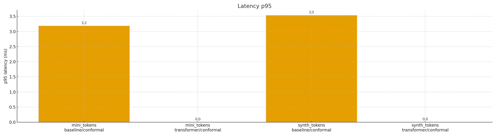
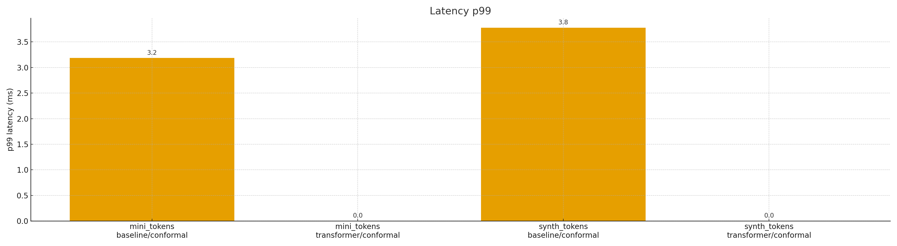

# log-project Streaming, Drift-Aware Log Anomaly Detection (Calibrated, Reproducible)

[](https://github.com/felipearche/log-project/actions/workflows/ci.yml)


## Quickstart


> For a deeper walkthrough and troubleshooting, see **[docs/HOWTO.md](docs/HOWTO.md)**.

### Windows (PowerShell)
```powershell
python -m venv .venv; .\.venv\Scripts\Activate.ps1
pip install -r env/dev-requirements.lock
pytest -q
```

### Docker (no local Python needed)
```bash
docker run --rm -v "${PWD}:/app" -w /app python:3.11.9-slim /bin/bash -lc   "pip install -r env/dev-requirements.lock && pytest -q"
```

### What this runs
- Installs pinned dev toolchain.
- Runs schema/format guard for `experiments/summary.csv` (via tests).
- Executes the test suite with coverage gate = 0 (temporary).

**At a glance**
- Model: TF-IDF + IsolationForest + Sliding Conformal; ADWIN resets for drift.
- Reproducibility: Docker base pinned by digest; CI actions pinned by SHA.
- Provenance: `data/HASHES.txt` (size + SHA-256), 24-column `experiments/summary.csv`.
- Hygiene: UTF-8 (no BOM), LF-only; protected JSONs byte-exact (no trailing LF).
- CI: schema/format validator for `summary.csv`; Windows runtime hash-locked.


## 0) Overview
A real-time log anomaly detector that:
1) scores each log line with a lightweight baseline (**TF-IDF + IsolationForest**),
2) enforces a target false-positive rate via **Sliding Conformal** (inductive, windowed), and
3) adapts to **drift** using **ADWIN** and **resets the calibrator on detected changes**.

Every run appends **one canonical row** to `experiments/summary.csv` (24-column schema).
Reproducibility pillars: **pinned environment** (`env/requirements.lock`), **Docker parity**, **commit capture** (`COMMIT` env → git short SHA → NA fallback), **UTF-8/LF policy**, and **strict provenance** (one block per CSV row).

> Portability: always mount with `-v "${PWD}:/app"` (quoted) so it works even if your path contains spaces.
> TPR formatting: for new rows, record `TPR_at_1pct_FPR` with **four decimals** (e.g., `1.0000`); leave older rows unchanged; use **literal `NA`** for unlabeled datasets.

---

## 0a) QA gates (pre-commit, mypy, pytest)

- pre-commit: ruff-check and ruff-format (housekeeping hooks can be enabled later if needed).
- mypy: light typing gate via mypy.ini (Python 3.11, ignore_missing_imports = True, warn_unused_ignores = True). CI runs "mypy src".
- pytest: 6 tests (+ conftest helper) covering tokenizer masks, summary schema (24 cols), calibration docs/ASCII, ADWIN→conformal reset, determinism, and smoke.

> Policy: run all three locally before pushing: pre-commit run --all-files → mypy src → pytest -q.

---

## 1) Quick reproduce (4 commands)

```powershell
# 1) Build the image from this folder
docker build -t log-project:latest .

# 2) Capture commit for results
$env:COMMIT = (git rev-parse --short HEAD).Trim()

# 3) Run the default pipeline (baseline, calibrated)
docker run --rm -v "${PWD}:/app" -e COMMIT=$env:COMMIT log-project:latest

# 4) Generate figures + README table (inside Docker for deps parity)
docker run --rm -v "${PWD}:/app" -e COMMIT=$env:COMMIT log-project:latest `
 python scripts/make_plots.py --summary experiments/summary.csv
docker run --rm -v "${PWD}:/app" -e COMMIT=$env:COMMIT log-project:latest `
 python scripts/make_readme_table.py --csv experiments/summary.csv --out README_TABLE.txt
```

Output: one new row in `experiments/summary.csv` + one provenance block in `docs/PROVENANCE.txt`.

> Optional: also generate vector figures for docs/slides: add `--svg` to `make_plots.py`. Prefer **PNG** in the repo; generate SVGs on demand (don't commit).

---

## 2) Experiment grid (2x2)

```powershell
$env:COMMIT = (git rev-parse --short HEAD).Trim()

# Calibrated (Sliding Conformal @ 1% target FPR)
docker run --rm -v "${PWD}:/app" -e COMMIT=$env:COMMIT log-project:latest `
 python -m src.stream --mode baseline --data data/synth_tokens.json --labels data/synth_labels.json
docker run --rm -v "${PWD}:/app" -e COMMIT=$env:COMMIT log-project:latest `
 python -m src.stream --mode baseline --data data/mini_tokens.json

# No-calib ablation (fixed threshold)
docker run --rm -v "${PWD}:/app" -e COMMIT=$env:COMMIT log-project:latest `
 python -m src.stream --mode baseline --data data/synth_tokens.json --labels data/synth_labels.json --no-calib
docker run --rm -v "${PWD}:/app" -e COMMIT=$env:COMMIT log-project:latest `
 python -m src.stream --mode baseline --data data/mini_tokens.json --no-calib
```

Each command emits exactly one `CSV_ROW:` and a matching provenance block.

---
### Transformer (adds 4 rows)

```powershell
$env:COMMIT = (git rev-parse --short HEAD).Trim()

# Calibrated (Sliding Conformal @ 1% target FPR)
docker run --rm -v "${PWD}:/app" -e COMMIT=$env:COMMIT log-project:latest `
 python -m src.stream --mode transformer --data data/synth_tokens.json --labels data/synth_labels.json
docker run --rm -v "${PWD}:/app" -e COMMIT=$env:COMMIT log-project:latest `
 python -m src.stream --mode transformer --data data/mini_tokens.json

# No-calib ablation (fixed threshold)
docker run --rm -v "${PWD}:/app" -e COMMIT=$env:COMMIT log-project:latest `
 python -m src.stream --mode transformer --data data/synth_tokens.json --labels data/synth_labels.json --no-calib
docker run --rm -v "${PWD}:/app" -e COMMIT=$env:COMMIT log-project:latest `
 python -m src.stream --mode transformer --data data/mini_tokens.json --no-calib
```

## 3) Results

### 3.1 Table

**Calibrated-only snapshot (from `README_TABLE.txt`):**

| dataset | mode | calibration | TPR@1%FPR | p95_ms | p99_ms | eps |
|---|---|---|---|---|---|---|
| synth_tokens | baseline | conformal | 1.0000 | 3.2 | 3.4 | 328.5 |
| synth_tokens | transformer | conformal | 0.9833 | 1.6 | 1.9 | 731.6 |
| mini_tokens | baseline | conformal | NA | 7.4 | 7.4 | 119.0 |
| mini_tokens | transformer | conformal | NA | 1.5 | 1.5 | 454.6 |

- Canonical table file: `README_TABLE.txt` (generated below).

```powershell
docker run --rm -v "${PWD}:/app" -e COMMIT=$env:COMMIT log-project:latest `
 python scripts/make_readme_table.py --csv experiments/summary.csv --out README_TABLE.txt

# (Optional) normalize "nan" → "NA" if any appear in the Markdown table output
$utf8NoBom = New-Object System.Text.UTF8Encoding($false)
$content = (Get-Content README_TABLE.txt -Raw) -replace "\bnan\b","NA"
[IO.File]::WriteAllText("README_TABLE.txt", $content + "`n", $utf8NoBom)
```

> The generator shows the **latest row per (dataset, mode, calibration)**. TPR is formatted to **4 decimals**; p95/p99/eps to **1 decimal**; any textual `nan` is rendered as **NA**.

### 3.2 Figures
> **Note:** SVGs are generated but not committed; prefer **PNG** in the repo; run `git clean -fdx` before packaging.


```powershell
docker run --rm -v "${PWD}:/app" -e COMMIT=$env:COMMIT log-project:latest `
 python scripts/make_plots.py --summary experiments/summary.csv
```

Embed examples (the plotting script writes to `figures/`):
```markdown



```

**Takeaway:** Sliding Conformal at 1% target FPR yields higher, stable TPR at the same FPR; ADWIN resets maintain alignment under drift.

---

### 3.3 Multi-config figures (recommended)

Use the duplicate-aware plotter to create **one-metric-per-figure** charts that compare all runs **without** duplicating identical configs.

**Windows (PowerShell)**

**Calibrated-only (recommended for README):**
```powershell
python scripts/make_multi_plots_v2.py --csv experiments/summary.csv --outdir figures --fmt png,svg --calibrations conformal --expect 4
```

**Full ablation set (calibrated + no-calib):**
```powershell
python scripts/make_multi_plots_v2.py --csv experiments/summary.csv --outdir figures\ablations --fmt png,svg --expect 8
```

**Docker/Linux (inside container or native shell)**

**Calibrated-only (recommended for README):**
```bash
python scripts/make_multi_plots_v2.py --csv experiments/summary.csv --outdir figures --fmt png,svg --calibrations conformal --expect 4
```

**Full ablation set (calibrated + no-calib):**
```bash
python scripts/make_multi_plots_v2.py --csv experiments/summary.csv --outdir figures/ablations --fmt png,svg --expect 8
```

Notes:
- The plotter collapses duplicate (dataset, mode, calibration) combos (default: **last**; use `--collapse median` to aggregate repeats).
- Rows with `p95_ms==0` or `p99_ms==0` are dropped by default (`--no-drop-zero-latency` to keep them).
- X-labels are `dataset` on line 1 and `mode/calibration` on line 2.
- Output files: `figures/latency_p95_ms.(png|svg)`, `figures/latency_p99_ms.(png|svg)`, `figures/throughput_eps.(png|svg)`.

## 4) Datasets and hashes (canonical)
Track every dataset in three places:

1. Tokenized logs live in `data/*.json`. See **`docs/DATASETS.md`** for schema, sizes, counts, and SHA-256.
2. **Policy:** `data/HASHES.txt` lists **`path size SHA256`** (three fields, two spaces). Exactly **4 entries** are expected. Use **uppercase 64-hex SHA-256**.
3. `docs/PROVENANCE.txt` one block per run, containing the **verbatim** `CSV_ROW:`.

- **Scope clarification (2025-09-03):** `data/` now contains **artifact data only**.
 Non-artifacts were relocated (`data/make_synth.py` → `scripts/`, `data/PROVENANCE.txt` → `docs/PROVENANCE.txt`, `data/DATASETS.md` → `docs/DATASETS.md`). `data/HASHES.txt` covers only artifact JSON/log files; docs/scripts are excluded.

**Regenerate hashes (preferred):**
```powershell
docker run --rm -v "${PWD}:/app" log-project:latest python scripts/hash_files.py
```

**Example entries (update if files change):**
```
data/synth_tokens.json  137400  8AF36305BB4FA61486322BFAFE148F6481C7FF1772C081F3E9590FB5C79E6600
data/mini_tokens.json   533     3CA2BCE42228159B81E5B2255B6BC352819B22FFA74BBD4F78AC82F00A2E1263
data/synth_labels.json  6000    814DA8A6BAB57EC08702DDC0EFFAC7AFDC88868B4C2EE4C6087C735FB22EDADA
data/raw/mini.log       310     F5953777A9A84819D55964E5772792CE8819A3FED1E0365FA279EB53F6496FB4
```

---

## 5) Provenance policy (strict)

### Format-only maintenance (history)

We enforce a 1:1 mapping between rows in `experiments/summary.csv` and blocks in `docs/PROVENANCE.txt`.

Each block includes: ISO date, commit short SHA, seed, input dataset, exact Docker command (with `--labels` for `synth_tokens` and `--no-calib` for ablations), and the **full `CSV_ROW:`**. All text files are **UTF-8 (no BOM)** with **LF** line endings.

**Rebuild provenance:**
```powershell
Set-ExecutionPolicy -Scope Process -ExecutionPolicy Bypass -Force
.\scripts\rebuild_provenance.ps1
type .\docs\PROVENANCE.txt
```

**Verify 1:1 mapping (strict):**
```powershell
$rows = (Get-Content experiments\summary.csv | Measure-Object -Line).Lines - 1
$provCsvRows = (Select-String -Path docs\PROVENANCE.txt -Pattern '^CSV_ROW:' | Measure-Object).Count
if ($rows -ne $provCsvRows) { throw "Provenance mismatch: CSV=$rows PROVENANCE=$provCsvRows" }
```

**CI checks:** equal counts (rows vs blocks), quoted mount path (`-v "${PWD}:/app"`), `CSV_ROW:` exactness (uppercase label), single trailing newline.

---

## 6) Canonical results schema (24 columns)
Policy: no blank cells - use `NA` when not applicable. `TPR_at_1pct_FPR` is numeric for labeled datasets and the literal `NA` for unlabeled.

Header (first line of `experiments/summary.csv`):
```
date,commit,dataset,mode,calibration,drift_detector,seed,events,anomalies,drifts,TPR_at_1pct_FPR,p95_ms,p99_ms,eps,CPU_pct,energy_J,calib_target_fpr,calib_window,warmup,adwin_delta,iso_n_estimators,iso_max_samples,iso_random_state,notes
```
- `energy_J` is **NA** on this hardware.
- **Formatting policy:** for new rows, prefer fixed-point **4 decimals** for TPR (e.g., `1.0000`); do **not** rewrite previous rows.
- `notes` may include: `baseline conformal;cpu_sampler=process_avg;energy_na`.

---

- **Note:** When `mode=transformer`, `iso_n_estimators`, `iso_max_samples`, and `iso_random_state` are recorded as **NA**.

## 7) Running the pipeline (CLI)
**Flags (most common):**
```
--data PATH # tokens JSON
--labels PATH # optional labels JSON for TPR metric
--alpha 0.01 # default 1% (alpha)
--window 5000 # sliding window size
--warmup 200 # warmup events
--no-calib # disable conformal (ablation)
--adwin-delta 0.002 # drift sensitivity
--save-scores PATH # per-event scores CSV (optional)
--summary-out experiments/summary.csv
--seed 20250819
--sleep_ms 0
```
**Drift handling:** On ADWIN change → increment drift count, call `calib.reset()`, continue.
For unlabeled datasets, `TPR_at_1pct_FPR` is the literal `NA`. CPU metric: `CPU_pct` is the mean **process** CPU%.

---

## 8) Tokenizer (deterministic)
- Lowercase.
- Special tokens: `<hex>` (`0x[0-9A-Fa-f]+`), `<ip>` (IPv4), `<num>` (`\d+`)
- Encoding: **UTF-8 (no BOM)**; input logs and token JSON are UTF-8.

Recreate tokens from raw:
```powershell
docker run --rm -v "${PWD}:/app" log-project:latest `
 python src/log_tokenize.py --in data/raw/mini.log --out data/mini_tokens.json
```

---

## 9) Determinism and seeds
- Canonical seed: **20250819** (experiments + synthesis).
- Python hashing determinism (optional):
```powershell
$env:PYTHONHASHSEED = "0"
```
- Two identical commands should yield identical `CSV_ROW` values except timestamp/commit.

---

## 10) Environment and build (pinned)
- `env/requirements.lock` pins exact versions (e.g., `numpy 1.26.4`, `scipy 1.16.1`, `scikit-learn 1.5.2`, `psutil 7.0.0`, `matplotlib`, etc.).
- Dockerfile installs only from the lockfile; `CMD` runs the default pipeline.
- **Dev-only utility:** `scripts/dev/fix_summary.py` requires **pandas**. Install it separately (e.g., `pip install pandas`) or list it in a dev-only file such as `env/dev-requirements.txt`.

Record actual versions from the built image:
```powershell
docker run --rm -v "${PWD}:/app" log-project:latest `
 python scripts/print_versions.py
```

---

## 11) Encoding and EOL policy

> **Note (protected JSONs):** The three data JSONs - `data/mini_tokens.json`, `data/synth_labels.json`, `data/synth_tokens.json` - are intentionally tracked **byte-for-byte** for provenance and hashing. They are marked `-text` in `.gitattributes` and must remain exactly identical to the published hashes, including **no trailing newline**. Most editors try to add one; please do not.

- All tracked text files are **UTF-8 (no BOM)** with **LF** line endings, and each file ends with a **single trailing newline**.
- Enforced by checked-in **`.gitattributes`** and **`.editorconfig`** (authoritative).
- Repo can be normalized with `git add --renormalize .` after setting the policy.

`.gitattributes` (excerpt):
```
* text=auto eol=lf
*.png binary
data/synth_tokens.json -text
data/mini_tokens.json -text
data/synth_labels.json -text
data/raw/mini.log -text
```

**Normalize now (one-time):**
```powershell
pwsh -NoProfile -ExecutionPolicy Bypass -File scripts/normalize_line_endings.ps1 -Path .
```

**Ignores for reproducibility:**
```
.venv/
__pycache__/
.pytest_cache/
experiments/logs/
_audited/
fsck.txt
*.bak
```

---

## 12) Testing
Covers:
- Tokenizer masking and lowercase.
- Summary schema (24 columns; p95_ms ≤ p99_ms)
- Calibration docs / ASCII.
- Drift conformal reset (smoke)
- Determinism (smoke)

```powershell
docker build -t log-project:latest .
docker run --rm -v "${PWD}:/app" log-project:latest `
 sh -lc 'python -m pip install --quiet pytest==8.3.3 && python -m pytest -q'
```

**Local venv (Windows):**
```powershell
py -3.11 -m venv .venv
.\.venv\Scripts\Activate.ps1
python -m pip install -U pip
python -m pip install -r env/requirements.lock
python -m pip install pytest==8.3.3
python -m pytest -q
```

---

## 13) Release (tag + zip + hashes + provenance)

**Note:** Release zips must exclude **.venv/**, **experiments/logs/**, **.pytest_cache/**, **__pycache__/**, and the **.git/** folder.

**Use the script (Windows / PowerShell):**
```powershell
# Create the release zip + write dist/HASHES.txt and dist/PROVENANCE.txt
pwsh -NoProfile -File .\scripts\make_release.ps1

# Verify contents and hashes
Get-ChildItem -Recurse dist\ | Select-Object FullName,Length
Get-Content dist\HASHES.txt
Get-Content dist\PROVENANCE.txt
```

**Policy:** Model artifacts and release hashes/provenance live under `dist/`.
Do **not** add model files or release hashes to `data/HASHES.txt` (that file must list only the four canonical data artifacts).

---

## 14) Fresh-clone reproducibility check
```powershell
cd ..
git clone https://github.com/felipearche/log-project log-project-fresh
cd log-project-fresh
docker build -t log-project:latest .
$env:COMMIT = (git rev-parse --short HEAD).Trim()
docker run --rm -v "${PWD}:/app" -e COMMIT=$env:COMMIT log-project:latest
```

Verify: one new CSV row + matching provenance block.

---

## 15) Metrics (definitions)
- **TPR_at_1pct_FPR** → TPR computed at the score threshold set by the 99th percentile of negatives (target FPR=1%).
- **p95_ms**, **p99_ms** → end-to-end per-event latency percentiles.
- **eps** → throughput, events per second.
- **CPU_pct** → process average CPU% during the run.
- **drifts** → ADWIN change detections (each triggers `calib.reset()`).

---

## 16) Motivation and impact
- **Reliability under drift:** Sliding Conformal + ADWIN maintain a stable operating point (1% FPR) in streaming settings.
- **Systems + ML:** We report latency (p95/p99), throughput (eps), and CPU% to demonstrate edge feasibility.
- **Reproducibility culture:** Docker, pinned env, dataset hashes, strict provenance, and encoding/EOL policy.

---

## 17) System and benchmark environment (recorded)
(Example capture; see `experiments/environment_snapshot.md` in this repo for the current machine.)

**CPU**
AMD Ryzen 7 5800HS with Radeon Graphics - 8 cores / 16 threads

**Memory**
TotalPhysicalMemoryBytes-15.41 GB

**OS**
Windows 11 Home (build 26100)

**Docker**
Client: 28.3.2 - Server: 28.3.2 - Docker Desktop 4.44.3

**Image Python/libs**
python==3.11.9; numpy==1.26.4; scikit-learn==1.5.2; matplotlib==3.9.2; psutil==7.0.0; scipy==1.16.1

> Note: All throughput/latency numbers in this README were measured on the above machine unless noted.

---

## 18) Data ethics and privacy

- Logs can contain sensitive data (PII, secrets). The tokenizer masks `0x` (as `<hex>`), IPv4 addresses (`<ip>`), and integers (`\d+`), but **this is not a full PII scrubber**.
- Before committing new datasets:
 - Remove or redact user identifiers, secrets/keys, tokens.
 - Prefer synthetic or anonymized logs for public sharing.
 - Document any remaining sensitive fields in `docs/DATASETS.md`.

---

## 19) Extending the project

**Add a dataset**
1. Place tokenized JSON in `data/NAME_tokens.json`. Optional labels: `data/NAME_labels.json`.
2. Update hashes: `docker run --rm -v "${PWD}:/app" log-project:latest python scripts/hash_files.py` (commits `data/HASHES.txt`).
3. Run the pipeline and commit the new summary/provenance.

**Add a model/detector**
1. Implement under `src/` (e.g., `src/detectors/my_detector.py`).
2. Register CLI options in `src/stream.py`.
3. Include any new hyperparams in the summary CSV and provenance block.
4. Add tests in `tests/` and update CLI flags if needed.

**Add a drift detector**
- Ensure a **reset hook** is called to flush conformal history on drift.

---

## 20) CI suggestion (GitHub Actions)

```yaml
# NOTE: For production, pin actions by SHA (e.g., actions/checkout@<SHA>)
name: CI

on:
 push:
 branches: [ master ]
 pull_request:
 branches: [ master ]

jobs:
 build:
 runs-on: ${{ matrix.os }}
 strategy:
 fail-fast: false
 matrix:
 os: [ubuntu-latest, windows-latest]
 python-version: ["3.11"]

 steps:
 - name: Checkout
 uses: actions/checkout@v4

 - name: Set up Python
 uses: actions/setup-python@v5
 with:
 python-version: ${{ matrix.python-version }}
 cache: pip
 cache-dependency-path: |
 env/requirements.lock
 env/requirements.txt

 - name: Install dependencies (hashed)
 run: |
 python -m pip install --upgrade pip
 pip install --require-hashes -r env/requirements.txt

 - name: Run pre-commit
 run: |
 pre-commit --version
 pre-commit run --all-files

 - name: Type check (mypy)
 run: |
 pip install mypy
 mypy src

 - name: Run tests
 run: |
 pytest -q
```

---

## 21) Troubleshooting

- **Plots script expects only `summary.csv`:** If you see references to `--scores`, update to the latest `scripts/make_plots.py` (figures are derived from `experiments/summary.csv` only).
- **`AttributeError: "SlidingConformal" object has no attribute "size"`:** Update to the latest code (the calibrator implements `size()` for compatibility with `src/stream.py`).

Other common issues:
- **Docker mount issues on Windows** → Always quote the mount: `-v "${PWD}:/app"`.
- **Table shows `nan`** → Regenerate the table (see 3.1); the generator renders textual `nan` as `NA`.
- **TPR formatting varies (`1` vs `1.0000`)** → Use `scripts/normalize_tpr_lastrow.py` after runs; don't rewrite historical rows.
- **CRLF→LF / missing final newline** `scripts/normalize_line_endings.ps1` fixes this across the repo.
- **PowerShell 5.1 vs 7** → Scripts are 5.1-compatible; prefer **pwsh 7+** for consistency.

---


## 22) Known limitations and reproducibility caveats

- **Latency/throughput vary with host load.** Results depend on background processes and CPU frequency scaling. For fair comparisons, run on an idle machine and consider repeating a run a few times and reporting the median.
- **Temporary miscalibration under extreme drift.** Sliding Conformal targets 1% FPR assuming the calibration window reflects recent data. When ADWIN triggers, the calibrator resets; transient windows may differ until enough post-reset data accumulates.
- **Determinism.** Seeds are fixed, but low-level BLAS threads and OS scheduling can cause tiny numeric jitter. We round TPR to 4 decimals and latency to 1 decimal to keep summaries stable; throughput (eps) can still vary slightly.
- **Energy metric.** `energy_J` is currently `NA` on this hardware; include it if you run on a machine with supported power telemetry.


## 23) License and citation

This project is licensed under the **MIT License**. See [LICENSE](LICENSE).

**How to cite:**
Felipe Arche. *log-project: Streaming, Drift-Aware Log Anomaly Detection (Calibrated, Reproducible).* 2025. Git repository.

See also `CITATION.cff` for a machine-readable citation.
**BibTeX:**

```bibtex
@misc{arche2025logproject,
  title   = {log-project: Streaming, Drift-Aware Log Anomaly Detection (Calibrated, Reproducible)},
  author  = {Felipe Arche},
  year    = {2025},
  howpublished = {GitHub repository},
  url     = {https://github.com/felipearche/log-project},
  note    = {Version 0.1.1 or later}
}
```


### Repository link
Repository-code: https://github.com/felipearche/log-project (also set in CITATION.cff)

```yaml
repository-code: https://github.com/felipearche/log-project
```

---

## Maintenance summaries (latest)
- **2025-09-05**: Documentation polish.
  → README: added **Quickstart** and **At a glance** sections; stabilized CI badge to `master`
  → Added Docker tip for running **pre-commit** in a container (install `git` and mark `/app` as a safe directory)
  → No code or data changes; tests: 6/6 passing in container

- **2025-09-05**: CI hardening (PR #2 squash-merged)
  → Pinned GitHub Actions by SHA; added `scripts/check_summary.py` schema/format validator
  → Docker base pinned by digest
  → Coverage gate set to 0 temporarily (will raise after more tests)
  → Runtime installs: Windows now uses hash-locked `env/requirements.txt`; Ubuntu uses non-hash `env/requirements.lock` until Linux hashes lock is generated
  → Dev tools installs are hash-locked via `env/dev-requirements.lock` on both OSes
  → Branch protection rules intentionally disabled for now; will re-enable later
  → PROVENANCE updated with PR #2 entry and a correction clarifying coverage=0

- **2025-08-31**: Encoding/EOL compliance - Added a single trailing LF to `scripts/make_release.ps1` to conform to the repo policy (UTF8 no BOM, LF, single trailing newline). See 11 for the policy and normalization script.; CPU_pct backfill (historic) - Backfilled two early `CPU_pct` blanks to the literal `NA` in `experiments/summary.csv` for full-column coverage and clarity. Immediately rebuilt `docs/PROVENANCE.txt` to preserve the strict 1:1 mapping with `CSV_ROW:` lines (postcheck: CSV rows=26; PROVENANCE CSV_ROW=26).; Tests - Post-change test suite: 4 passed.

- **2025-08-30**: TPR formatting policy enforced - `TPR_at_1pct_FPR` is four decimals for `synth_tokens` (e.g., `1.0000`) and the literal `NA` for `mini_tokens`. See the experiment schema and the table generator script.; Provenance 1:1 rebuilt - `docs/PROVENANCE.txt` now has exactly one `CSV_ROW:` per row in `experiments/summary.csv` (counts match). A `notes:` line was added to the latest block documenting this maintenance.; README table regenerated - `README_TABLE.txt` reflects the latest row per (dataset, mode, calibration) with canonical formatting (TPR 4dp, p95/p99/eps 1dp, `NA` where applicable).

- **2025-09-03**: Repository hygiene and provenance scope - Moved non-artifacts out of `data/` (`scripts/`, `docs/`); updated references to `docs/PROVENANCE.txt`; added `.gitattributes` (LF policy; keep protected JSONs byte-exact); ignored `.ruff_cache/` in `.gitignore`. Provenance 1:1 mapping unchanged; metrics unchanged.

- **2025-09-03**: **Assets and attributes**.
 - Normalized 3 SVGs in `figures/` (CRLF→LF; stripped trailing whitespace; UTF-8 no BOM; single final LF).
 - Updated `.gitattributes` to mark `*.png` as **binary** (prevents EOL normalization and diffs on images); normalized `.gitattributes` to **LF**.
 - Added a dated PROVENANCE note recording the actual Docker base image and the above maintenance.
 - Hooks: all passing; tests: unchanged; metrics/results: unchanged.

- **2025-09-03** (IST): **Green build** and repo hygiene.
 - Fixed mid-token splits in `src/stream.py`, `src/calibration.py`, `src/log_tokenize.py`, and `scripts/make_plots.py`.
 - Corrected summary writing in `src/stream.py`: **TPR** now formatted to **4 decimals or `NA`**; **anomalies** column now records `n_anom` (previously mis-written).
 - Enforced **LF** line endings across the tree; removed **UTF-8 BOM** from `.pre-commit-config.yaml`; widened local **BOM guard** to include `ya?ml`.
 - Re-generated `experiments/summary.csv` **with labels** for `synth_tokens`; `p95 <= p99` and TPR formatting policy satisfied.
 - **Pre-commit:** all hooks pass; **tests:** 6 passed (`pytest==8.3.3`).
 - **Policy reminders:** three protected JSONs (`data/mini_tokens.json`, `data/synth_labels.json`, `data/synth_tokens.json`) remain byte-identical with **no trailing newline**; `data/HASHES.txt` unchanged (4 lines, uppercase 64-hex SHA-256).
---

## Release Packaging (Reproducible)


### Clean release ZIP (no `.git`)

To produce a lightweight source archive that excludes `.git` and untracked files, use `git archive`. This includes only files committed to the repository.

**Windows PowerShell**
```powershell
# From repo root on the branch or tag you want to release
git status
pre-commit run --all-files
pytest
mypy

mkdir dist 2>$null
git archive --format=zip --output=dist/log-project-src.zip HEAD

# Or archive a specific tag for reproducibility:
# git archive --format=zip --output=dist/log-project-v0.1.1.zip v0.1.1
```

**Bash**
```bash
# From repo root on the branch or tag you want to release
git status
pre-commit run --all-files
pytest
mypy

mkdir -p dist
git archive --format=zip --output=dist/log-project-src.zip HEAD

# Or archive a specific tag for reproducibility:
# git archive --format=zip --output=dist/log-project-v0.1.1.zip v0.1.1
```

Notes:
- The archive does not include `.git/` or untracked files.
- If you need generated assets in the ZIP, commit them first or package them separately.
- After cloning, run `pre-commit install` to enable local hooks.


Policy recap: UTF-8 **without BOM**, **LF-only** line endings; a single final LF on text files.
Exceptions: `data/mini_tokens.json`, `data/synth_labels.json`, `data/synth_tokens.json` must **not** end with a newline.

---

## Appendix A — Reproducibility checklist (one glance)

- **Environment.** Use Python 3.11; prefer Docker for parity.
- **Install dev tools.**
  ```powershell
  pre-commit install
  pip install -r env/dev-requirements.lock
  ```
- **QA gates.**
  ```powershell
  pre-commit run --all-files
  mypy .
  pytest -q
  ```
- **Artifacts integrity.**
  ```powershell
  python scripts/audit_repo.py
  # Validates: protected JSONs (no final LF), data/HASHES.txt (size+SHA-256),
  # 24-col experiments/summary.csv, PROVENANCE block count, CI/citation guards.
  ```
- **Provenance sync.**
  ```powershell
  Set-ExecutionPolicy -Scope Process -ExecutionPolicy Bypass -Force
  .\scripts\rebuild_provenance.ps1
  python scripts\audit_repo.py
  ```
- **Figures (PNG preferred).** Regenerate locally and commit PNGs; keep SVGs uncommitted unless necessary.

## Appendix B — Troubleshooting

- **CRLF or BOM detected.** Run:
  ```powershell
  pwsh -NoProfile -File .\scripts\audit_and_fix.ps1
  # Re-run audit to confirm:
  python scripts\audit_repo.py
  ```
- **“Found X CSV_ROW but Y rows in summary.”** Rebuild provenance:
  ```powershell
  .\scripts\rebuild_provenance.ps1
  ```
- **Docker volume with spaces in path.** Always mount with quotes:
  ```powershell
  docker run --rm -v "${PWD}:/app" -w /app python:3.11.9-slim ...
  ```
- **ExecutionPolicy blocks scripts.** Use a process-scoped bypass:
  ```powershell
  Set-ExecutionPolicy -Scope Process -ExecutionPolicy Bypass -Force
  ```

## Appendix C — Support matrix

| OS                | Python | Notes                                                  |
|-------------------|--------|--------------------------------------------------------|
| Windows 10/11     | 3.11   | Primary dev target; PowerShell commands documented.   |
| Ubuntu 22.04 LTS  | 3.11   | CI target; parity with Windows via Docker.            |

## Appendix D — Release packaging checklist

1. `pre-commit run --all-files`, `mypy .`, `pytest -q` — all green.
2. `python scripts/audit_repo.py` — **All checks passed.**
3. Rebuild provenance; confirm `CSV_ROW:` count == data rows.
4. Regenerate figures; commit **PNGs only**.
5. Update `CITATION.cff` if version/date changed.
6. Tag release and (if applicable) `git archive` into `dist/` (ignored by Git).

## Appendix E — FAQ (short)

**Q. Why are protected JSONs missing a final newline?**
A. They are byte-for-byte tracked to support SHA-256 integrity verification via `data/HASHES.txt`.

**Q. Why do you pin actions and environments?**
A. To guarantee audit-grade reproducibility and stable CI behavior across time.

**Q. My throughput numbers differ slightly.**
A. Host load and OS scheduling can introduce jitter; repeat runs and report the median.
